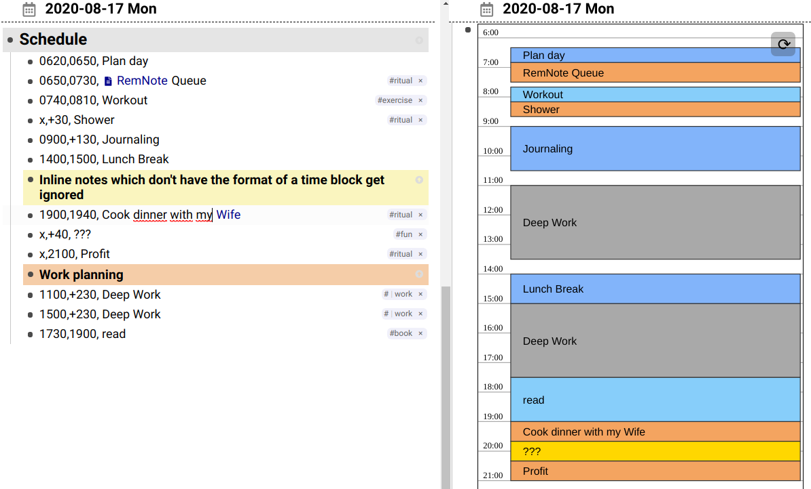
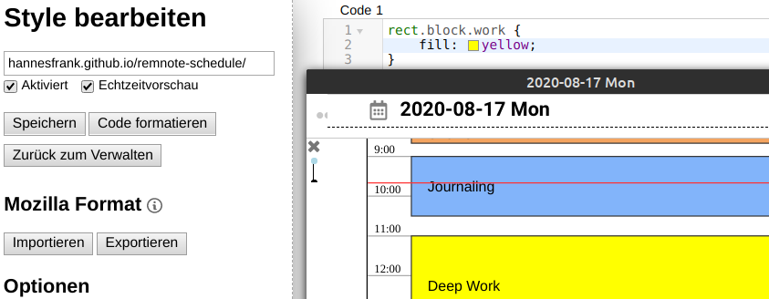

# RemNote-Schedule

Visualize your daily schedule.



## Usage

Add the plugin to a document and it renders all entries under a parent with the name `Schedule`.

**Important:** You have to put `Schedule` as a direct child of
the Document/Rem you are currently in or it will not be found.

The syntax was developed by [CrushEntropy](https://crushentropy.com/). It is designed to be typed fast and to easily reschedule if things change. See the original tool for a guide.

Basically you write Rems of the following form

```
HHMM,HHMM,description #tag
```

Each line represents a time block. It consists of a start time, an end time and a description for that time block.
You can also use tags to categorize and color blocks.

As a shortcut you can use

- `x` as start time to indicate that it should start right when the previous ended
- `+MM`/`+HMM` as a end time to indicate that the time block lasts `MM` minutes / `H` hours and `MM` minutes. **Note:** This parses `+120` as 1 hour 20 minutes, not 2 hours.

To refresh the graph click the reload icon in the top right or enable auto-reloading (see [Auto Reload](#auto-reload)).

### Tips

- Use <kbd>Alt</kbd> + <kbd>Up</kbd>/<kbd>Down</kbd> to swap tasks of the form `x,+30`.

- ~~To configure the color of a tag, go to `Custom CSS` and add a block like this:~~ This does not work because you can't style an iframe. Use [Stylus](https://github.com/openstyles/stylus) instead

```
rect.block.YOUR_TAG {
  fill: lime;
}
```



## Installation

Add this URL to your [RemNote plugins](https://www.remnote.io/plugins):

- **Plugin Name:** `remnote-schedule` (or anything you like)
- **Plugin Description:** `Visualize your daily schedule.` (or anything you like)
- **Plugin URL:** `https://hannesfrank.github.io/remnote-schedule/index.html`
- **CSS Height:** `600px`
- **CSS Width:** `400px`
- **Permissions:** `Read`

Add the plugin to a Document with the `/remnote-schedule` command.

## Additional Settings

You can add additional parameters to the plugin URL after an `?` in `key=value`.
Parameters must be separated by `&`.

```
https://hannesfrank.github.io/remnote-schedule/index.html?schedule-name=Tagesplan&start-time=300&end-time=2400&auto-reload=2000
```

### Schedule Name

The plugin does not search for events under the `Schedule` rem but under some other text.

**Default:** `Schedule`

**Example:** In German it would be called `Tagesplan`:

```
schedule-name=Tagesplan
```

**Note:** Special characters like spaces have to be URL encoded. So ` ` becomes `%20`.

### Auto Reload

The schedule refreshes automatically after X milliseconds.
Clicking the reload button toggles the auto-reload.

**Default:** 5 seconds (5000 ms).

**Example:** Reload every 2.5 seconds:

```
auto-reload=2500
```

**Example:** Turn it off.

```
auto-reload=off
```

You can reload the schedule manually with the reload button now.

### Start and End Time

Specify the start and/or end time of the schedule.

**Default:**

- Start Time: 6 AM
- End Time: 22 PM

**Example:** 3 AM to 24 PM

```
start-time=300&end-time=2400
```

## Development

Install the dependencies.
The API can be symlinked to allow editing it:

```
git submodule update
cd remnote-api
yarn link
cd ..
yarn link remnote-api
yarn install
```

Add a plugin `remnote-schedule-dev` with the above settings.

```
http://localhost:1234/index.html
```

Run the plugin locally:

```
yarn dev
```

### Deployment

```
yarn deploy
```

## Known Issues

- The `children` list of a rem gets sorted wrong leading to wrong schedules using the `x` syntax. Try reloading the page.
- I have not implemented the multi column layout yet. The current single column might bug if you reschedule/overwrite things.

## Roadmap

- [ ] **Turn roadmap into issues!** :tounge:
- [x] Read events from RemNote
  - [ ] Proper error handling with feedback. What happens if you are zoomed into the schedule? Or the plugin is itself a child of schedule?
  - [ ] Make `get_by_name` work to find "Schedule" anywhere in the subtree.
- [x] Ignore non-event Rems
- [x] Tags
  - [ ] Auto color tags so we don't have to install stylus.
- [ ] Handle intersecting events
  - [ ] Handle event inside another in Single-column
  - [ ] Support Multi-column
- [x] Ability to Reload
  - [x] Reload with `setInterval`
  - [ ] Watch Rem changes
- [ ] Nested blocks: Event Rems which are indented in a Event Rem get rendered as subblock
- [ ] Separate plugin settings page which has settings for colors, icons etc.
  - `- #RRGGBB: RemReference` colors events tagged with `#RemReference`
  - Maybe autohighlight the Rem when adding a tag
- [ ] Interactivity (this would need write access)
  - Click on a block to open the rem
  - Delete block (Rem gets hidden?)
  - Drag to reschedule
  - Maybe use a different calendar view, not SVG+D3.js.
